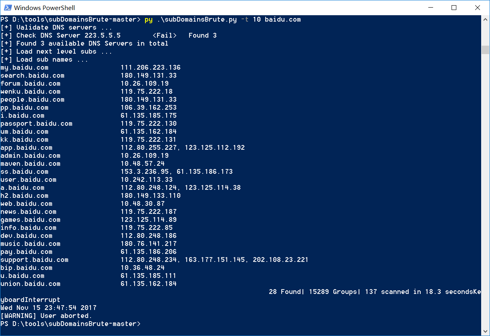

# 子域名爆破工具subDomainsBrute
* 地址：https://github.com/lijiejie/subDomainsBrute
## 功能：
使用几个常见DNS查询，递归枚举子域名，可以另外添加DNS，还可以指定线程数。小字典有一万五千多条，大字典有六万三千多条。
## 用法：
```
subDomainsBrute.py [options] <目标域名>
Options:
  --version             show program's version number and exit
  -h, --help            show this help message and exit
  -f FILE               指定字典文件，默认使用dict/subnames.txt
  --full                使用大字典dic/subnames_full.txt
  -i, --ignore-intranet
                        忽略指向私有IP的域名
  -t THREADS, --threads=THREADS
                        指定线程数，默认100
  -o OUTPUT, --output=OUTPUT
                        输出文件名，默认为<目标域名>.txt
```
比如：`python subDomainsBrute.py -t 10 baidu.com`

如果想修改查询的DNS，可以修改dict/dns_servers.txt
